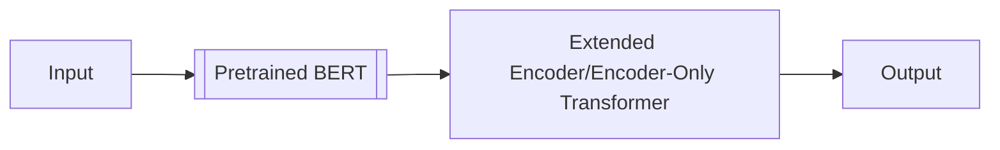

This implementation of encoder-only transformer adapter is inspired by the papers ["Attention is All You Need" (2017)](https://arxiv.org/abs/1706.03762) by Ashish Vaswani, Noam Shazeer, Niki Parmar, Jakob Uszkoreit, Llion Jones, Aidan N. Gomez, Lukasz Kaiser, Illia Polosukhin and ["LoRA: Low-Rank Adaptation of Large Language Models (2021)"](https://arxiv.org/abs/2106.09685) by Edward J. Hu, Yelong Shen, Phillip Wallis, Zeyuan Allen-Zhu, Yuanzhi Li, Shean Wang, Lu Wang, Weizhu Chen.

- **Hugging Face:** [Hugging Face](https://huggingface.co/lif31up/attention-is-all-you-need)
- **Note & Reference:** [GitBook](https://lif31up.gitbook.io/lif31up/natural-language-process/attention-is-all-you-need), [LLMs from Scratch](https://github.com/rasbt/LLMs-from-scratch)
- ⭐**Quickstart on Colab:** [Colab](https://colab.research.google.com/drive/1oEwK7Tz-XvABJQ9-ypHznY24vD_uq4h_?usp=sharing)

|                   | **IMBD**             | **SQuAD 2.0** |
|-------------------|----------------------|-----------|
| **Extended BERT** | `100%` **(500/500)** | (ongoing) |

## Extended BERT for Low-rank Adaption
To modify from-scratch experience, I objected to codes encoder-only transoformer head for pre-trained params `bert-base-uncased`.

- **Task:** classifying movie reviews as positive or negative.
- **Dataset:** `IMDB` dataset, which contains 50,000 movie reviews labeled as positive or negative.
- **Pretrained Model:** `bert-base-uncased`

### Objection: Add an Encoder-Only Transformer as Adapter
The **encoder stack** in this implementation contains two sublayers: a multi-head self-attention mechanism and a simple, fully connected feed-forward network. These sublayers are connected through residual connections and layer normalization.
1. **Multi-Head Attention Layer:** multi-head attention mechanism → residual connection → layer normalization
2. **Feed Forward Layer:** feed-forward network → residual connection → layer normalization

This stack performs as an adapter or head for down-streamed tasks:


---
### Configuration
`confing.py` contains the configuration settings for the model, including the number of heads, dimensions, learning rate, and other hyperparameters.
```python
class Config: # free to tweak the params as you want
  def __init__(self):
    self.n_heads = 12
    self.n_stacks = 1
    self.n_hidden = 2
    self.dim = 768
    self.output_dim = 2
    self.bias = True

    self.dropout = 0.1
    self.attention_dropout = 0.1
    self.eps = 1e-3
    self.betas = (0.9, 0.98)
    self.epochs = 5
    self.batch_size = 16
    self.lr = 1e-4
    self.clip_grad = False
    self.mask_prob = 0.3

    self.pretrained_model = "bert-base-uncased"
    self.textset, self.testset_for_test = get_textset()
    self.save_to = "your_path"
    self.embedder, self.tokenizer = get_embedder(self.pretrained_model) ) # you can change the tokenizer setting on `./tokenizer.json`.
    self.dummy = embed(text='hello, world', model=self.embedder, tokenizer=self.tokenizer)
```
### Training
`train.py` is a script to train the model on the IMDB dataset. It includes the training loop, evaluation, and saving the model checkpoints.

```python
from config import Config
from model.Transformer import Transformer

device = torch.device('cuda' if torch.cuda.is_available() else 'cpu')
bert_config = Config()
trainset = EmbeddedDataset(dataset=bert_config.textset, dim=bert_config.dim, embedder=bert_config.embedder,
                           model=bert_config.embedder)
model = Transformer(bert_config)
train(model=model, path=bert_config.save_to, trainset=trainset, config=bert_config, device=device)
```
### Evaluation
`eval.py` is used to evaluate the trained model on the IMDB dataset. It loads the model and tokenizer, processes the dataset, and computes the accuracy of the model.
```python
if __name__ == "__main__":
  device = torch.device('cuda' if torch.cuda.is_available() else 'cpu')
  my_data = torch.load('your path', map_location='cpu', weights_only=False)
  my_config = my_data['config']
  my_model = Transformer(my_config)
  my_model.load_state_dict(my_data['state'])
  testset = EmbeddedDataset(dataset=my_config.testset_for_test, dim=my_config.dim, embedder=my_config.embedder, model=my_config.embedder)
  counts, n_problems = evaluate(my_model, testset, device)
  print(f"Accuracy: {counts / n_problems:.4f}")
```
---
## Technical Highlights
The model's architecture consists of several key components, including multi-head attention, feed-forward networks, and layer normalization. It is designed to process input sequences and extract meaningful features for various natural language processing tasks.

### Multi-Head Attention
The model employs a multi-head attention mechanism, which allows it to focus on different parts of the input sequence simultaneously. This is achieved by projecting the input into multiple subspaces, computing attention for each subspace, and then concatenating the results.

```python
class MultiHeadAttention(nn.Module):
  def __init__(self, config, mode="scaled", init_weights=None):
    super(MultiHeadAttention, self).__init__()
    assert config.dim % config.n_heads == 0, "Dimension must be divisible by number of heads"
    self.config = config
    self.sqrt_d_k, self.mode = (config.dim // config.n_heads) ** 0.5, mode
    self.w_q, self.w_k = nn.Linear(config.dim, config.dim, bias=config.bias), nn.Linear(config.dim, config.dim, bias=config.bias)
    self.w_v, self.w_o = nn.Linear(config.dim, config.dim, bias=config.bias), nn.Linear(config.dim, config.dim, bias=config.bias)
    self.ln, self.dropout, self.softmax = nn.LayerNorm(config.dim), nn.Dropout(config.attention_dropout), nn.Softmax(dim=1)

    if init_weights: self.apply(init_weights)

  def forward(self, x, y=None):
    Q = self.w_q(x)
    (K, V) = (self.w_k(x), self.w_v(x)) if self.mode != "cross" else (self.w_k(y), self.w_v(y))
    raw_attn_scores = torch.matmul(Q, K.transpose(-2, -1))
    down_scaled_raw_attn_scores = raw_attn_scores / self.sqrt_d_k
    if self.mode == "masked":
      masked_indices = torch.rand(*down_scaled_raw_attn_scores.shape[:-1], 1) < self.config.mask_prob
      down_scaled_raw_attn_scores[masked_indices] = float("-inf")
    attn_scores = self.softmax(down_scaled_raw_attn_scores)
    attn_scores = self.dropout(attn_scores)
    return self.ln(torch.matmul(attn_scores, V) + x)
```

### Encoder Stack
The stack consists of multiple layers of multi-head attention and feed-forward networks. Each layer applies a multi-head attention mechanism followed by a feed-forward network, with residual connections and layer normalization applied at each step.
* Since the model is an encoder-only transformer and text classification task that does not require unidirectional attention(masked attention), the `mode` is set to `"scaled"` for the multi-head attention mechanism. However, masking is performed at the input layer by `BPEDataset`. This is common convention for modern BERT-like models.
* The feed-forward network consists of multiple linear layers with GELU activation functions, allowing the model to learn complex representations of the input data.
* Modern BERT implementations (aka encoder-only transformer) often locate the layer normalization firstly, which is different from the original paper. This implementation follows original convention.

```python
class EncoderStack(nn.Module):
  def __init__(self, config, init_weights=None):
    super(EncoderStack, self).__init__()
    self.mt_attn = MultiHeadAttention(config, init_weights=init_weights, mode="scaled")
    self.ffn = nn.ModuleList()
    for _ in range(config.n_hidden):
      self.ffn.append(nn.Linear(config.dim, config.dim, bias=config.bias))
    self.activation, self.ln = nn.GELU(), nn.LayerNorm(config.dim)
    self.dropout = nn.Dropout(config.dropout)

    if init_weights: self.ffn.apply(init_weights)

  def forward(self, x):
    res = x
    x = self.ln(self.mt_attn(x) + res)
    res = x
    for i, layer in enumerate(self.ffn):
      if i != len(self.ffn): x = self.dropout(self.activation(layer(x)))
      else: x = self.dropout(layer(x))
    return self.ln(x + res)
```

### Model
The model is constructed using multiple encoder stacks. Each stack processes the input sequentially, applying multi-head attention and feed-forward networks to extract features from the input data.

```python
class Transformer(nn.Module):
  def __init__(self, config, init_weights=None):
    super(Transformer, self).__init__()
    self.stacks = nn.ModuleList([EncoderStack(config, init_weights=init_weights) for _ in range(config.n_stacks)])
    self.fc, self.flatten = self._get_fc(self.config.dummy), nn.Flatten(start_dim=1)

  def forward(self, x):
    for stack in self.stacks: x = stack(x)
    return self.fc(self.flatten(x))

  def _get_fc(self, dummy):
    with torch.no_grad():
      for stack in self.stacks: dummy = stack(dummy)
    dummy = self.flatten(dummy)
    return nn.Linear(dummy.shape[1], self.config.output_dim, bias=self.config.bias)
```
